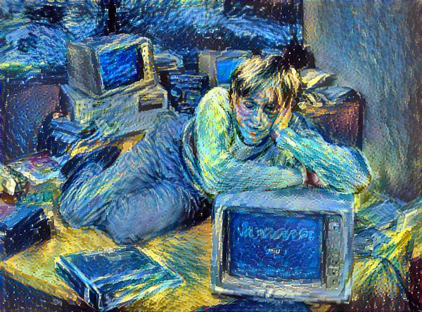
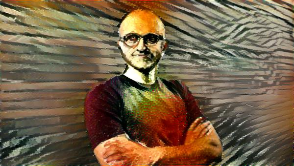

# Neural Algorithm of Artistic Style

This example shows the implementation of of the paper [A Neural Algorithm of Artistic Style](http://arxiv.org/abs/1508.06576). They use deep learning to extract the style of a picture and transfer it to a new image. 

## Download data
To download the data:

	cd data
	python download_data.sh

## Run Neural Algorithm for Artistic Style

To run the algorithm in a GPU (see `--help` for more options):
    
	cd python/mxnet  
	python neural_style.py --gpu 0 

# Results
We can combine a picture of Bill Gates with the style of Vincent van Gogh's Starry Night:

We can also combine a picture of Satya Nadella with the style of Pablo Picasso self protrait:

The computation took 5 min in a NVIDIA K-80.